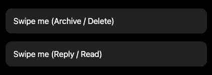

# React Swipe Row Component 🚀

A highly customizable, iOS-style swipeable row component for React applications. Built with `framer-motion` for buttery-smooth spring physics animations. Perfect for creating lists with interactive hidden actions like "Archive", "Delete", or "Reply".


[](https://swipe-row.onrender.com/)


---

<br />
<div align="center">
  
</div>
<br />

---

## ✨ Features

- **👀 Live Demo:** Try it out instantly at **[swipe-row.onrender.com](https://swipe-row.onrender.com/)**
- **Fluid Animations:** Powered by [Framer Motion](https://www.framer.com/motion/) with native-feeling spring physics.
- **Dynamic Actions:** Pass an unlimited number of custom action buttons (Edit, Delete, Archive, etc.).
- **Automatic Styling:** Built-in basic styling with CSS Modules so it just works out of the box without polluting global scopes.
- **Dark Mode Support:** Automatically detects system preferences and adjusts action background colors.
- **Fully Typed:** Written in TypeScript for excellent Developer Experience and IntelliSense.
- **Zero Config:** Auto-calculates swipe distances based on your button widths.

---

## 📦 Installation

```bash
npm install swipe-row framer-motion
# or
yarn add swipe-row framer-motion
# or
pnpm add swipe-row framer-motion
```

*Note: `framer-motion` is required as a peer dependency for animations.*

---

## 💻 Usage

First, import the component and the necessary CSS styles into your React file:

```tsx
import { SwipeRow } from 'swipe-row';
import 'swipe-row/style.css'; // Important for default styling!
```

### Basic Example (Single Action)

```tsx
function BasicList() {
  return (
    <SwipeRow
      actions={[
        {
          label: 'Delete',
          onClick: () => console.log('Deleted!'),
          backgroundColor: '#ef4444', // Tailwind red-500
        }
      ]}
    >
      <div style={{ padding: '16px' }}>
        Swipe me to the left!
      </div>
    </SwipeRow>
  );
}
```

### Advanced Example (Multiple Actions)

You can pass multiple action objects. The component will automatically calculate how far the user needs to swipe.

```tsx
function EmailList() {
  const handleArchive = () => alert('Archived');
  const handleReply = () => alert('Replying...');

  return (
    <SwipeRow
      actions={[
        {
          label: 'Reply',
          onClick: handleReply,
          backgroundColor: '#3b82f6', // Tailwind blue-500
          width: 80, // Default is 80px
        },
        {
          label: 'Archive',
          onClick: handleArchive,
          backgroundColor: '#f59e0b', // Tailwind amber-500
          width: 90, 
        }
      ]}
    >
      <div style={{ padding: '20px', borderBottom: '1px solid #eee' }}>
        <h4>Job Application Updates</h4>
        <p>You have successfully submitted your resume...</p>
      </div>
    </SwipeRow>
  );
}
```

---

## 🛠 Props

### `SwipeRow`

| Prop | Type | Default | Description |
|---|---|---|---|
| `children` | `React.ReactNode` | **Required** | The main visible content of your row. |
| `actions` | `SwipeAction[]` | **Required** | Array of action configurations to be revealed on swipe. |
| `maxSwipe` | `number` | `undefined` | Override the automatic swipe width calculation (px). |
| `className` | `string` | `undefined` | Custom CSS class applied to the root container. |
| `style` | `React.CSSProperties` | `undefined` | Custom inline style applied to the root container. |
| `innerClassName` | `string` | `undefined` | Custom CSS class applied to the foreground swipeable element. |
| `innerStyle` | `React.CSSProperties` | `undefined` | Custom inline style applied to the foreground swipeable element. |

### `SwipeAction` Object

Configure each button in the `actions` array:

| Property | Type | Default | Description |
|---|---|---|---|
| `label` | `React.ReactNode` | **Required** | The text or icon to show inside the button. |
| `onClick` | `() => void` | **Required** | Function to call when clicked. |
| `backgroundColor` | `string` | `'#64748b'` | CSS background color for the button. |
| `color` | `string` | `'white'` | CSS text color. |
| `width` | `number` | `80` | Width of the button in pixels. Used for auto element calculation. |
| `className` | `string` | `undefined` | Custom CSS class applied to the button element. |
| `ariaLabel` | `string` | `label` string value | For screen readers. |

---

## 🧪 Local Development

1. Clone the repository
2. Install dependencies: `npm install`
3. Start the Vite playground: `npm run dev`
4. Run unit tests: `npm run test`
5. Build the library: `npm run build`

---

## 📄 License

MIT © nahkar - Feel free to use in personal and commercial projects!
